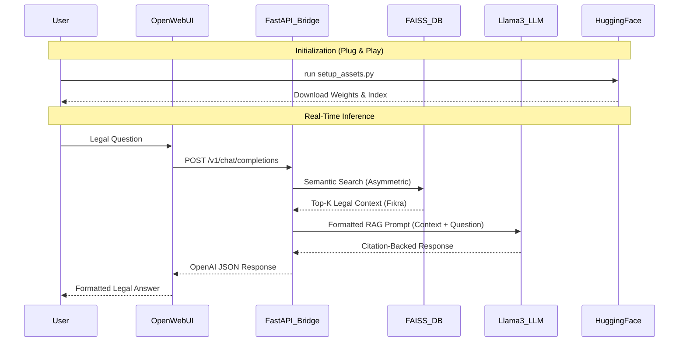

# ⚖️ Kanuntek: Turkish Legal RAG Pipeline
> **Note:** This project is presented strictly as a **Computer Engineering AI Training Project**. It is a research-focused implementation of a high-fidelity RAG pipeline and is not a commercial product.

**Kanuntek** demonstrates the end-to-end engineering cycle of domain-adapting a multilingual embedding model and integrating it into a citation-safe local inference system.

## 🏛️ System Architecture

This project is documented through two distinct engineering perspectives: the **Infrastructure Distribution** (Macro-view) and the **Functional Module Logic** (Micro-view).

### 1. Infrastructure & Distribution (Macro-View)
This diagram illustrates the "Plug-and-Play" synchronization between cloud assets and the local engineering environment.

```text
=================================================================================================
                                   I. INFRASTRUCTURE & ASSET TOPOLOGY
=================================================================================================

      [ REMOTE: HUGGING FACE ]                 [ REMOTE: GITHUB ]
      ┌─────────────────────────┐              ┌────────────────────────┐
      │ Repo: kanuntek-assets   │              │ Repo: Hadi-AI0/Kanuntek│
      │ ├─ legal-e5-final/      │              │ ├─ scripts/ (Logic)    │
      │ ├─ vector_store/        │              │ ├─ src/     (Core)     │
      │ └─ llama-3.2-3b.gguf    │              │ └─ pyproject.toml      │
      └────────────┬────────────┘              └───────────┬────────────┘
                   │ (HTTPS / snapshot_download)           │ (Git Clone)
                   ▼                                       ▼
      ┌──────────────────────────────────────────────────────────────────────────────────┐
      │                        LOCAL ENVIRONMENT (Windows/Linux)                         │
      │   [ Directory: /models/ ]                     [ Directory: /scripts/ ]           │
      │   ├─ E5 Weights (FP16)  │                     ├─ setup_assets.py     │           │
      │   ├─ FAISS Index (.bin) │◀────────────────────┤ api_server.py (Live) │           │
      │   └─ GGUF Model (4-bit) │                     └─ rag_app.py   (Core) │           │
      └────────────┬───────────────────────────────────────┬─────────────────────────────┘
                   │                                       │
      ┌────────────┴────────────────────────┐     ┌────────┴─────────────────────────────┐
      │       COMPUTE LOAD BALANCING        │     │         NETWORK INTERFACE           │
      ├─────────────────────────────────────┤     ├─────────────────────────────────────┤
      │ [GPU] (20%) : Llama Layers 1-10     │     │ [Port 8081] : FastAPI (JSON)        │
      │ [CPU] (80%) : Logic / Search / Text │     │ [Schema]    : OpenAI Compatible     │
      └─────────────────────────────────────┘     └─────────────────────────────────────┘
=================================================================================================
```

### 2. Functional Module Logic (Micro-View)
This diagram details the internal relationships, function signatures, and data flow within the Python codebase.

```text
=================================================================================================
                                   II. FUNCTIONAL MODULE ARCHITECTURE
=================================================================================================

    [ USER INTERFACE ]           [ API BRIDGE ]                 [ RAG ORCHESTRATOR ]
   ┌──────────────────┐       ┌────────────────────┐          ┌───────────────────────────┐
   │   Open WebUI     │       │   api_server.py    │          │        rag_app.py         │
   │ (Web Frontend)   │──────▶│ ├─ list_models()   │◀─────────┤ ├─ setup_rag()            │
   └──────────────────┘       │ └─ chat_compl()    │          │ ├─ ask_kanuntek(query)    │
            │ (JSON)          └──────────┬─────────┘          │ └─ CHAT_HISTORY (deque)   │
            ▼                            │                    └─────────────┬─────────────┘
   ┌──────────────────┐                  │                                  │
   │    CLI MODE      │                  │                                  │
   │ (scripts/rag_app)│◀─────────────────┘                  ┌───────────────┼──────────────┐
   └──────────────────┘                                     ▼               ▼              ▼
                                                 ┌────────────────┐ ┌───────────────┐ ┌──────────────┐
       [ DATA FLOW ]                             │document_reader │ │   utils.py    │ │  prompts.py  │
       User Query  ──┐                           ├────────────────┤ ├───────────────┤ ├──────────────┤
            │        ▼                           │+load_secure()  │ │+clean_text()  │ │+RAG_PROMPT   │
       Linguistic Fix (utils)                    │+PyPDF Parse    │ │+prepare_e5()  │ │+SUM_PROMPT   │
            │        ▼                           └────────────────┘ └───────────────┘ └──────────────┘
       FAISS Retrieval (k=3)                              │                 │                │
            │        ▼                                    └─────────────────┴──────┬─────────┘
       Prompt Formatting (prompts)                                                 │
            │        ▼                                                             ▼
       Llama-3.2 Generation  ───────────────────────────────────────────────────▶ Result
=================================================================================================
```

---

## 🛠️ Technical Architecture & Research Goals
Kanuntek explores the optimization of **Retrieval-Augmented Generation (RAG)** for technical languages on consumer-grade hardware.

### 1. The Research Stack
*   **Domain Adaptation (Phase 1):** Fine-tuning `intfloat/multilingual-e5-small` via Masked Language Modeling (MLM) to capture Turkish legal jargon.
*   **Instruction-Alignment (Phase 2):** Optimizing the latent space via Multiple Negatives Ranking Loss (MNRL) to resolve the asymmetric retrieval problem.
*   **Local Inference:** Investigating the performance-to-vram ratio of quantized `Llama-3.2-3B` models on standard CPUs.


### 2. Core Features
*   ** Citation Integrity:** Automatically cites specific Articles (Madde) and Paragraphs (Fıkra) to prevent hallucinations.
*   ** Conversational Memory:** Uses a sliding-window architecture to maintain context during follow-up questions.
*   ** Secure Workspace:** Drop private PDF/TXT files into the session. They are indexed in **ephemeral RAM** and never stored in the main database.
*   ** Hardware Balancing:** Pre-configured for "Partial GPU Offloading" (10 layers), delivering high speed on regular CPUs while utilizing free VRAM if available.

---

##  Getting Started

### 1. Prerequisites
- Python 3.10+
- Recommended: 16GB RAM
- Optional: NVIDIA GPU (GTX 1060+ for best performance)

### 2. Installation
```powershell
# Clone the repository
git clone https://github.com/Hadi-AI0/Kanuntek.git
cd Kanuntek

# Install dependencies
pip install .
```

### 3. Asset Initialization (Plug & Play)
Kanuntek requires the fine-tuned model weights and the vector database index. Run the automated setup script to pull these assets from the cloud:
```powershell
python scripts/setup_assets.py
```

---

##  Usage

### **Option A: Professional Web UI (Open WebUI)**
1. Launch the API server:
   ```powershell
   ./start_kanuntek.bat
   ```
2. Open your **Open WebUI Desktop**.
3. In **Settings > Connections**, add `http://localhost:8081/v1` as an OpenAI provider.
4. Select `kanuntek-legal-rag` and start chatting.

### **Option B: Secure Document Analysis**
Use the CLI command within the app to analyze private documents:
- `/load [path/to/file.pdf]` : Securely indexes the file for the current session.
- `/reset` : Clears the conversational history.

---

## 📁 Project Structure

```text
Kanuntek/
├── .gitignore               # Deployment filter (excludes large models/data)
├── pyproject.toml           # Python package metadata and dependencies
├── requirements.txt         # Pip dependency list
├── start_kanuntek.bat       # Windows one-click API launcher
├── scripts/
│   ├── api_server.py        # OpenAI-compatible FastAPI bridge
│   ├── setup_assets.py      # Hugging Face synchronization script
│   ├── rag_app.py           # Core RAG logic and memory management
│   ├── index_data.py        # FAISS database creation tool
│   └── document_reader.py   # Secure PDF/TXT parser
├── src/
│   ├── prompts.py           # Optimized Llama-3.2 prompt templates
│   └── utils.py             # Turkish linguistic cleaning and E5 prefixing
└── models/                  # [AUTO-GENERATED] Storage for synced assets
    ├── legal-e5-final/      # Fine-tuned embedding weights
    └── vector_store/        # FAISS production index
```

---

## 📐 System Architecture (UML)

The following diagram illustrates the data flow from cloud synchronization to real-time RAG inference:



---

## 📦 Deployment & Distribution Guide

Kanuntek is designed as a split-asset package to ensure GitHub remains efficient while assets remain high-fidelity.

### **1. Cloud Asset Linking (Hugging Face)**
The intelligence of Kanuntek resides on Hugging Face. The `scripts/setup_assets.py` script acts as a bridge:
*   It looks for the `HF_REPO` defined in the script.
*   It synchronizes your local `models/` directory with the fine-tuned weights and the pre-built FAISS index.

### **2. Fresh Installation (Plug & Play)**
To run Kanuntek on a new machine:
1.  **Clone:** `git clone https://github.com/Hadi-AI0/Kanuntek.git`
2.  **Install:** `pip install .`
3.  **Sync:** `python scripts/setup_assets.py`
4.  **Run:** `./start_kanuntek.bat`

---

## 📈 Engineering Pipeline


Kanuntek's development follows a rigorous 4-phase cycle:
1.  **Phase 1 (MLM):** Domain adaptation on 270k+ legal units to synchronize vocabulary.
2.  **Phase 2 (Contrastive):** Instruction alignment using Multiple Negatives Ranking Loss (Loss: 0.79).
3.  **Phase 3 (Indexing):** Hierarchical vectorization into the FAISS production database.
4.  **Phase 4 (Deployment):** Quantized GGUF inference and UI bridging.

---
*Disclaimer: Kanuntek is an AI assistant and does not constitute legal advice. Always verify information with the official Resmi Gazete.*
